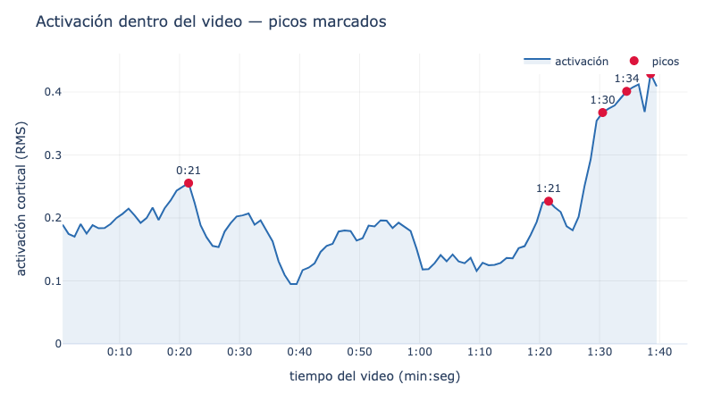
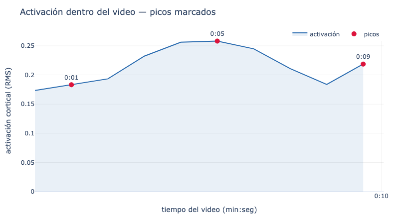
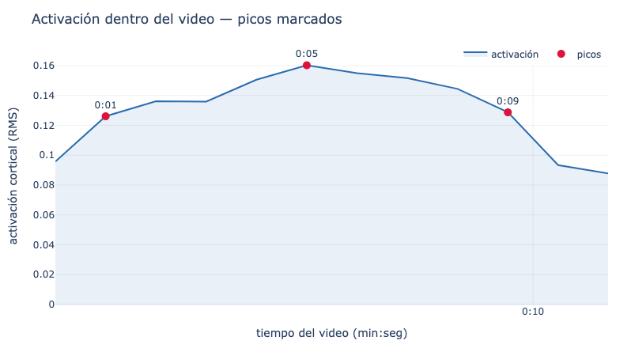
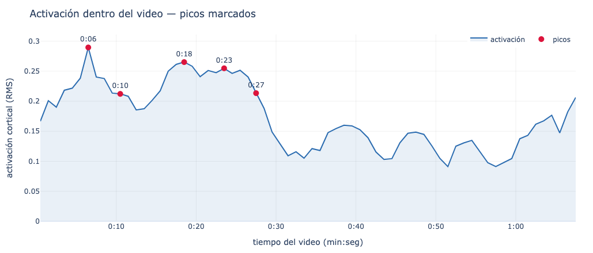

# TRIBE v2 — Actividad cerebral a partir de un video 🧠🎬

Sube un video y obtén una curva que estima **cuánta actividad cerebral provoca, instante por instante**.
Por debajo usa **TRIBE v2** (V‑JEPA2 + LLaMA‑3.2 + Wav2Vec2‑BERT), un modelo que predice la respuesta
de la corteza cerebral (señal fMRI) ante estímulos de video y audio.

---

## ¿Qué hace, en una frase?

> Entra un **video** → sale un **número por instante** (qué tan fuerte responde el cerebro) → se dibuja como una **curva con picos**, donde cada pico es un momento de máxima activación.

---

## Cómo usarlo (3 pasos)

No necesitas instalar nada en tu computadora ni tener GPU: todo corre en **Google Colab**.

1. **Abre el notebook** con el botón _Abrir en Colab_ de arriba.
2. En Colab activa GPU (`Entorno de ejecución → Cambiar tipo de entorno → GPU`) y **ejecuta las celdas en orden**.
   Pega tu token de Hugging Face cuando se pida (LLaMA‑3.2 requiere aceptar su licencia).
3. **Sube tu video**, indica su duración en `VIDEO_DUR` y listo: obtienes la **gráfica interactiva** y un **CSV** con el puntaje por segundo.

> ⚠️ El modelo es grande (~24 GB ideales). En la T4 gratis de Colab funciona con videos cortos; para videos largos usa Colab Pro (L4/A100).

---

## Ejemplos (video ↔ gráfica, 1 a 1)

Cada gráfica salió del notebook con el video de al lado. El eje X es el **tiempo del video (min:seg)**
y los puntos rojos son los **picos** de activación.

Reproduce cada video y observa cómo los **picos** de su gráfica coinciden con los momentos del video.

### Ejemplo 1 · 1:38 · picos 0:21, 1:21, 1:30, **1:34** (clímax al final)

<table>
<tr>
<td width="38%"><video src="https://github.com/TeoEchavarria/tribe/raw/master/examples/1.mp4" controls muted width="100%"></video></td>
<td width="62%"></td>
</tr>
</table>

### Ejemplo 2 · 0:09 · picos 0:01, **0:05**, 0:09

<table>
<tr>
<td width="30%"><video src="https://github.com/TeoEchavarria/tribe/raw/master/examples/2.mp4" controls muted width="100%"></video></td>
<td width="70%"></td>
</tr>
</table>

### Ejemplo 3 · 0:11 · picos 0:01, **0:05**, 0:09

<table>
<tr>
<td width="38%"><video src="https://github.com/TeoEchavarria/tribe/raw/master/examples/3.mp4" controls muted width="100%"></video></td>
<td width="62%"></td>
</tr>
</table>

### Ejemplo 4 · 1:07 · picos **0:06**, 0:18, 0:23, 0:27 (actividad al inicio)

<table>
<tr>
<td width="38%"><video src="https://github.com/TeoEchavarria/tribe/raw/master/examples/4.mp4" controls muted width="100%"></video></td>
<td width="62%"></td>
</tr>
</table>

> 💡 También tienes la galería en un solo archivo: [`examples/index.html`](examples/index.html) (ábrela en el navegador o publícala con GitHub Pages).

---

## Cómo leer la gráfica

- **Eje X** = tiempo del video (`min:seg`). **Eje Y** = activación cortical (RMS).
- Mira la **forma, no el valor absoluto**: el modelo solo predice la parte de la señal que explica el
  estímulo, así que el valor siempre queda **por debajo de 1**. Lo que importa es **dónde sube**.
- Cada **pico** = momento de mayor respuesta cerebral predicha.
- **Retardo hemodinámico (~4–6 s):** la señal cerebral va con retraso, así que la escena que
  _causa_ un pico suele estar unos segundos **antes** del punto marcado.

---

## Qué hay en este repo

| Archivo | Para qué |
|---|---|
| [`tribe_activation_colab.ipynb`](tribe_activation_colab.ipynb) | **Empieza aquí.** Notebook para Colab: subir video → curva + CSV. |
| [`examples/`](examples/) | Videos de ejemplo (`*.mp4`), sus gráficas (`*.png`) y la galería [`index.html`](examples/index.html). |
| [`tribe_activation_api.py`](tribe_activation_api.py) | API REST (FastAPI) para correr el modelo en un servidor con GPU. |
| [`Dockerfile`](Dockerfile) | Empaqueta esa API para desplegarla en un servidor GPU (x86/NVIDIA). |
| [`requirements.txt`](requirements.txt) | Dependencias de la API/Docker. |

> **Colab vs. Docker:** el notebook es la vía simple para **probar**. El Docker/API es para **desplegar**
> el modelo como servicio en una GPU en la nube cuando lo necesites.

---

## Cómo funciona por dentro (resumen)

1. El video se separa en **imagen** y **audio**.
2. Tres modelos extraen características: **V‑JEPA2** (video), **Wav2Vec2‑BERT** (audio) y **LLaMA‑3.2** (lenguaje/transcripción).
3. TRIBE v2 las combina y predice la señal fMRI en **20 484 vértices** de la corteza, un valor por **TR** (~1 s).
4. Se resume cada instante con el **RMS** sobre esos vértices → la curva de activación A(t).

---

## Licencia

Los pesos de **TRIBE v2 son CC BY‑NC** (uso no comercial). Revisa también la licencia de cada modelo base
(LLaMA‑3.2 es _gated_ y requiere aceptar sus términos en Hugging Face).
